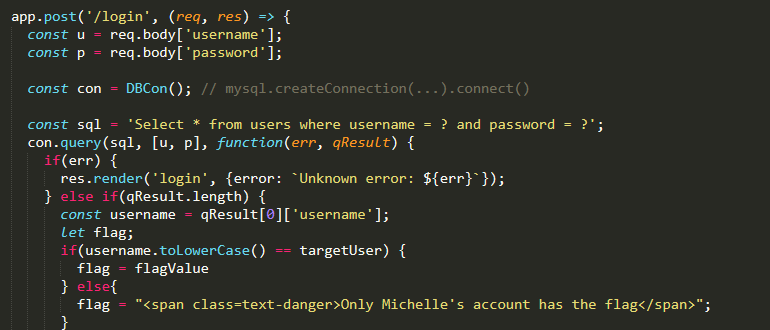
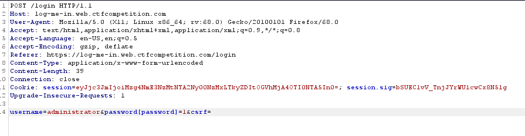
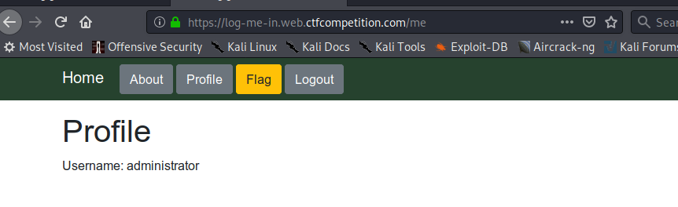
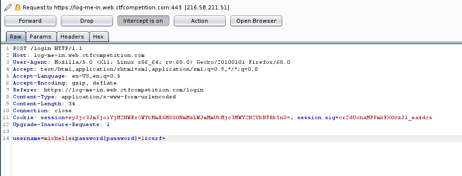
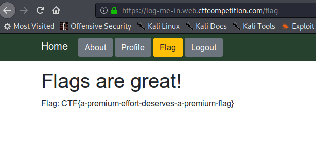

## LOG-ME-IN write up by Ambrotd

We have a node express app with a login where the input is sent straight to the db

This mean we can modify the username and password and send them as an array

With this request we are logged in as administrator, but we need to be michelle to get the flag:

So we can send the username as michelle:

And we got the flag:

